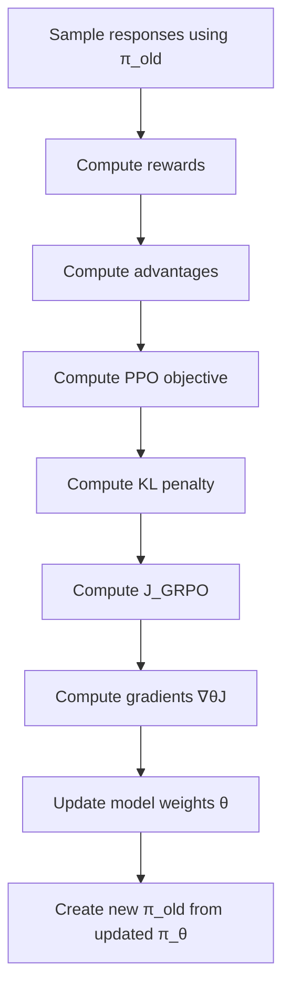

When reading papers about **GRPO (Group Relative Policy Optimization)**, it is easy to get lost in equations and implementation details.

The best way to understand GRPO is to see how **reward**, **advantage**, **PPO clipping**, **KL divergence**, and the **training loop** fit together in one complete update.

In this article, we'll walk through a complete numerical example step by step.

> GRPO is a reinforcement learning algorithm designed for LLM post-training that removes the need for a separate value model while still providing a strong learning signal.
{: .prompt-info }

## The Three Policies in GRPO

Before we look at the math, it helps to understand the three policies involved in a GRPO update.

| Policy | Role | Updated? |
|--------|------|----------|
| $\pi_{ref}$ | Reference model used for KL regularization | No |
| $\pi_{old}$ | Frozen behavior policy that generated the sampled responses | No |
| $\pi_{\theta}$ | Current trainable policy being optimized | Yes |

At the start of a training iteration:

$$
\pi_{old} = \pi_{\theta}
$$

Then the model samples responses using $\pi_{old}$, computes rewards, and updates $\pi_{\theta}$ while keeping $\pi_{old}$ fixed during that optimization round.

---

## 1. Why GRPO Generates Multiple Responses

Consider the prompt:

> Write a polite customer support reply.

Instead of generating a single response, GRPO samples multiple responses:

- $o_1$
- $o_2$
- $o_3$

Each response is evaluated by a reward model.

Suppose the rewards are:

$$
R_1 = 0.9,\quad R_2 = 0.6,\quad R_3 = 0.2
$$

At this point we know which response performed better, but we still need a signal that tells the model how much better one response was compared to the others.

That signal is called the **advantage**.

---

## 2. Computing the GRPO Advantage

GRPO computes advantages relative to other responses generated for the same prompt.

First compute the group mean reward:

$$
\mu = \frac{0.9 + 0.6 + 0.2}{3} = 0.5667
$$

Next compute the standard deviation:

$$
\sigma \approx 0.2867
$$

The GRPO advantage is:

$$
A_i = \frac{R_i - \mu}{\sigma}
$$

Applying the formula:

$$
A_1 \approx 1.16,\quad A_2 \approx 0.12,\quad A_3 \approx -1.28
$$

### Interpretation

| Response | Reward | Advantage |
|----------|--------|-----------|
| $o_1$ | 0.90 | +1.16 |
| $o_2$ | 0.60 | +0.12 |
| $o_3$ | 0.20 | -1.28 |

This tells the model:

- $o_1$ is significantly better than average
- $o_2$ is slightly better than average
- $o_3$ is worse than average

> Positive advantages increase probability. Negative advantages decrease probability.
{: .prompt-tip }

---

## 3. Computing the PPO Policy Ratio

Now we compare the current policy with the policy that generated the samples.

At the moment the batch was collected, the snapshot policy was:

$$
\pi_{old}(o_1|q)=0.20,\quad \pi_{old}(o_2|q)=0.30,\quad \pi_{old}(o_3|q)=0.10
$$

Suppose after one optimization step, the current policy becomes:

$$
\pi_{\theta}(o_1|q)=0.25,\quad \pi_{\theta}(o_2|q)=0.25,\quad \pi_{\theta}(o_3|q)=0.05
$$

The PPO ratio is:

$$
\rho_i = \frac{\pi_\theta(o_i|q)}{\pi_{old}(o_i|q)}
$$

Therefore:

$$
\rho_1 = 1.25,\quad \rho_2 = 0.83,\quad \rho_3 = 0.50
$$

PPO optimizes:

$$
\min\Big(\rho A,\text{clip}(\rho,1-\epsilon,1+\epsilon)A\Big)
$$

The clipping term prevents excessively large policy updates.

For example, if we use:

$$
\epsilon = 0.2
$$

then the allowed range is:

$$
[1-\epsilon, 1+\epsilon] = [0.8, 1.2]
$$

So for $o_1$:

$$
\text{clip}(1.25) = 1.2
$$

and the PPO term becomes:

$$
\min(1.25 \times 1.16,\; 1.2 \times 1.16)
=
\min(1.45,\; 1.392)
=
1.392
$$

---

## 4. Why GRPO Adds KL Divergence

If we optimize only for reward, the model may:

- drift away from pretrained behavior,
- learn reward-hacking strategies,
- forget useful capabilities.

To prevent this, GRPO keeps the policy close to a reference model.

Let:

$$
r = \frac{\pi_{ref}(o|q)}{\pi_{\theta}(o|q)}
$$

GRPO uses the following per-sample KL estimator:

$$
r - \log(r) - 1
$$

This estimator has several useful properties:

- always non-negative,
- equals zero when both policies are identical,
- computable from a single sampled output,
- its expectation corresponds to the KL regularization term used in the objective.

For example, if:

$$
\pi_{ref}(o_1|q)=0.30
$$

and

$$
\pi_{\theta}(o_1|q)=0.25
$$

then:

$$
r = \frac{0.30}{0.25} = 1.2
$$

The KL estimator becomes:

$$
1.2 - \log(1.2) - 1 \approx 0.0177
$$

If we choose:

$$
\beta = 0.1
$$

then the KL penalty is:

$$
0.1 \times 0.0177 = 0.00177
$$

> The KL term acts like a safety rail that prevents the policy from drifting too far away from the reference model.
{: .prompt-info }

---

## 5. Putting Everything Together

The complete GRPO objective is:

$$
J_{GRPO}
=
\mathbb{E}
\left[
\min\Big(
\rho A,
\text{clip}(\rho,1-\epsilon,1+\epsilon)A
\Big)
-
\beta
\Big(
r-\log(r)-1
\Big)
\right]
$$

This objective combines three important ideas.

### 1. Advantage

Advantage determines whether a response is better or worse than the other responses generated for the same prompt.

### 2. PPO Clipping

Clipping prevents unstable policy updates.

### 3. KL Regularization

KL divergence prevents the policy from drifting too far away from the reference model.

---

## 6. One Complete Numerical GRPO Update

Let us now compute one full example for response $o_1$.

We already have:

$$
A_1 = 1.16
$$

$$
\rho_1 = 1.25
$$

$$
\epsilon = 0.2
$$

So the clipped ratio is:

$$
\text{clip}(1.25) = 1.2
$$

The PPO part is:

$$
\min(1.25 \times 1.16,\; 1.2 \times 1.16)
=
\min(1.45,\; 1.392)
=
1.392
$$

Now the KL part is:

$$
r - \log(r) - 1 \approx 0.0177
$$

With:

$$
\beta = 0.1
$$

the KL penalty becomes:

$$
0.00177
$$

So the per-sample GRPO contribution is:

$$
J_1 = 1.392 - 0.00177 = 1.39023
$$

That is the number this sample contributes to the overall objective.

In practice, the total objective is the expectation over all sampled responses in the batch.

---

## 7. What Happens After $J_{GRPO}$ Is Computed?

This is the part that often gets skipped.

The objective value itself is not directly optimized. Instead, it is used to compute gradients that determine how the model parameters should change.

The optimizer computes:

$$
\nabla_\theta J_{GRPO}
$$

and then updates the model weights:

$$
\theta \leftarrow \theta + \alpha \nabla_\theta J_{GRPO}
$$

where $\alpha$ is the learning rate.

### Training Flow

## 8. Quiz : Active Recall 

