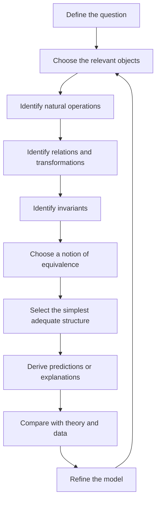

{: .shadow .rounded-10 }

For much of early mathematics, the subject can feel like a collection of formulas.

Algebra teaches methods for solving equations. Calculus introduces rules for differentiation and integration. Linear algebra brings matrices and systems of equations. Probability introduces random variables, expectations, and distributions.

This naturally creates a familiar habit:

> Which formula should be applied to this problem?

As mathematics becomes more abstract, a more important question appears:

> What kind of structure is already present in this problem?

In this article, we will turn that shift into a concrete modeling algorithm: begin with the question, identify the objects and their structure, decide what must be preserved, and only then choose - or construct - the mathematics.

> Mathematics is not only the study of numbers. It is also the study of structures, relations, transformations, and the properties that remain unchanged under them.
{: .prompt-info }

## The Building Blocks of a Mathematical Structure

Before looking at the algorithm, it helps to separate the ingredients that make up a mathematical structure.

| Component | Question it answers | Examples |
|-----------|---------------------|----------|
| Objects | What are the entities? | numbers, vectors, points, graphs, functions |
| Operations | What can be done to them? | addition, scaling, composition, concatenation |
| Relations | How are they compared or connected? | order, distance, adjacency, containment |
| Transformations | How may their descriptions change? | rotation, relabeling, coordinate change |
| Laws | Which rules must always hold? | associativity, transitivity, distributivity |
| Invariants | What should remain unchanged? | distance, connectivity, probability, shape |
| Equivalence | When are two descriptions structurally the same? | isomorphism, isometry, homeomorphism |

A useful first approximation is:

$$
\text{Mathematical structure}
=
\text{objects}
+
\text{operations}
+
\text{relations}
+
\text{laws}.
$$

A fuller picture also includes the transformations between objects, the invariants preserved by those transformations, and the notion of equivalence appropriate to the problem.

---

## 1. Why the Symbol $<$ Can Mean Different Things

One of the first clues appears in the definition of an ordered set.

An ordered set consists of a set $S$ together with a relation, usually denoted by $<$, satisfying properties such as trichotomy and transitivity.

For any $x,y\in S$, exactly one of the following holds:

$$
x<y,\qquad x=y,\qquad y<x.
$$

And if

$$
x<y \quad \text{and} \quad y<z,
$$

then

$$
x<z.
$$

The definition does not say that $<$ must mean ordinary numerical less-than. It says that $<$ is a relation satisfying particular laws.

This becomes striking in the construction of the real numbers using Dedekind cuts. The objects are suitable subsets of $\mathbb{Q}$, and the strict order is defined by proper inclusion:

$$
\alpha<\beta
\quad\Longleftrightarrow\quad
\alpha\subsetneq\beta.
$$

Here the symbol $<$ means **proper inclusion**, not ordinary numerical comparison. It behaves as an order because the required axioms are satisfied.

> A mathematical symbol receives its meaning from the objects on which it acts, the definition assigned to it, and the laws that definition satisfies.
{: .prompt-tip }

The relation cannot be chosen carelessly. A proposed relation must actually satisfy the axioms of the structure being claimed.

---

## 2. Begin With the Question

Before choosing a mathematical object, identify what the model must explain, predict, compare, or decide.

The same real-world system can require different structures for different questions.

Consider a collection of cities.

- If geographical distance matters, the cities may be points in a metric space.
- If transportation links matter, they may be vertices in a graph.
- If population movement matters, they may be states in a dynamical or probabilistic model.
- If economic comparison matters, they may be represented by feature vectors.

The cities have not changed. The mathematical structure changes because the question changes.

> The first modeling question is not "What mathematics can be used?" but "What must this model allow us to ask and answer?"
{: .prompt-info }

A model cannot be chosen independently of its purpose.

---

## 3. Identify the Relevant Objects

The next step is to decide what the fundamental entities of the model should be.

They might be:

- numbers,
- points,
- people,
- road segments,
- images,
- signals,
- functions,
- probability distributions,
- physical states,
- words,
- documents,
- or complete networks.

This choice is already an abstraction.

A road system may use intersections as objects, road segments as objects, complete routes as objects, or traffic flows as objects. Each representation makes different questions easier or harder to express.

The best choice is not the one containing the most detail. It is the one that retains the information required by the question.

---

## 4. Identify the Natural Operations

Operations describe what can meaningfully be done with the objects.

Ask whether the objects can be:

- combined,
- added,
- scaled,
- composed,
- averaged,
- concatenated,
- transformed,
- decomposed,
- or reversed.

Different operations suggest different structures.

If objects can be added and scaled, a vector-space structure may be present. If transformations can be composed and inverted, a group may be relevant. If quantities can be added, multiplied, subtracted, and divided, a field may be appropriate.

If road segments can be joined end to end, path composition matters even though numerical addition of roads may not.

> The important question is not whether an operation can be invented formally. It is whether the operation represents something meaningful in the phenomenon.
{: .prompt-tip }

---

## 5. Identify the Relations and Transformations

Relations describe how objects are connected, compared, or associated.

The relevant relation might be:

- order,
- distance,
- similarity,
- adjacency,
- containment,
- dependence,
- causality,
- or equivalence.

Transformations describe how objects may change.

An image may be translated, rotated, resized, or recolored. A signal may be shifted in time. A graph may have its vertices renamed. A geometric object may be expressed in a different coordinate system.

This adds an important idea:

> Mathematics studies not only objects, but also maps between objects.

Depending on the structure they preserve, these maps may be called homomorphisms, linear maps, continuous maps, isometries, or isomorphisms.

Understanding the relevant maps is often as important as identifying the objects themselves.

---

## 6. Identify Invariants and Equivalence

An invariant is a property that should remain unchanged under transformations regarded as irrelevant to the problem.

For example:

- rotating a rigid object should not change its shape,
- renaming the vertices of a graph should not change its connectivity,
- changing coordinates should not change the underlying geometry,
- reordering the elements should not change a set,
- a small translation of an image should often not change its label.

A useful modeling question is therefore:

> Which changes should not matter?

This leads naturally to the question of equivalence.

Two mathematical objects may look different while carrying the same relevant structure. Two graphs can be drawn differently and use different vertex names while preserving the same connection pattern. Two vector spaces can use different coordinates while having the same linear structure.

Different notions of structural sameness include:

- isomorphism,
- isometry,
- congruence,
- homeomorphism,
- and statistical equivalence.

The correct notion depends on what must be preserved.

For example, two spaces may be equivalent topologically while not being equivalent metrically: continuity may be preserved even when distances are changed.

---

## 7. Choose the Simplest Adequate Structure

Only after identifying the question, objects, operations, relations, transformations, invariants, and equivalence should a mathematical framework be selected.

| Feature in the problem | Structure to consider |
|------------------------|-----------------------|
| Comparison or ranking | Ordered set |
| Addition and scaling | Vector space |
| Distance or similarity | Metric space |
| Angles and projections | Inner-product space |
| Connections and paths | Graph |
| Continuous deformation | Topological space |
| Curved local geometry | Manifold |
| Uncertainty | Probability space |
| Reversible symmetries | Group |

The table is not a menu from which exactly one item must be selected. A problem may require several structures at once.

The richest possible structure is not automatically the best model.

> Prefer the simplest structure that preserves enough information to answer the question.
{: .prompt-tip }

If only connectivity matters, a plain graph may be sufficient. If travel time matters, a weighted graph may be needed. If travel time changes and is uncertain, a time-dependent probabilistic graph may be justified.

---

## 8. Mathematical Structures Are Often Layered

Structures are often built by starting with a base structure and adding more information.

For example:

$$
\text{set}
\longrightarrow
\text{vector space}
\longrightarrow
\text{normed vector space}
\longrightarrow
\text{Banach space}.
$$

At each stage, the earlier structure remains and a new property is added.

Similarly:

$$
\text{graph}
\longrightarrow
\text{directed graph}
\longrightarrow
\text{weighted directed graph}
\longrightarrow
\text{time-dependent probabilistic graph}.
$$

This is why real-world problems rarely fit into exactly one mathematical category.

A machine-learning system may involve:

- vector spaces for representations,
- probability for uncertainty,
- graphs for relationships,
- optimization for learning,
- groups for symmetries,
- and geometry for the shape of the data space.

The goal is not to force the phenomenon into one label. The goal is to identify which layers of structure are useful.

---

## 9. Worked Example: Modeling Traffic

Consider the question:

> What is the fastest route between two locations during rush hour?

A real road system contains roads, intersections, vehicles, traffic lights, weather, speed limits, and many other details. The model should retain only what is required for route planning.

| Modeling question | Traffic example |
|-------------------|-----------------|
| Objects | intersections and road segments |
| Operations | concatenate road segments to form paths |
| Relations | a road connects one intersection to another |
| Measurements | expected travel time on each road |
| Transformations | relabeling intersections |
| Invariants | reachability and path cost |
| Equivalence | graph isomorphism preserving directions and weights |

The resulting structure is a **directed weighted graph**.

If rush-hour travel times change throughout the day, the weights should depend on time. If travel times are uncertain, the weights may be represented by probability distributions.

The structure evolves as the question becomes richer:

$$
\text{graph}
\longrightarrow
\text{directed weighted graph}
\longrightarrow
\text{time-dependent probabilistic directed graph}.
$$

If the task were only to determine whether two locations are connected, the plain graph would already be enough.

---

## 10. Worked Example: Image Recognition

Now consider another question:

> Does this image contain a particular object?

Here the modeling process may begin with transformations and invariants.

A small translation, mild rotation, or slight change in brightness should often leave the label unchanged. These desired invariances influence how the image should be represented.

Images may be represented as:

- arrays of pixel values,
- vectors in $\mathbb{R}^n$,
- functions on a grid,
- or points in a learned feature space.

The resulting model may combine:

| Requirement | Mathematical structure |
|-------------|------------------------|
| image representation | vector space |
| similarity between images | metric or inner product |
| rotations and translations | transformation group |
| uncertain predictions | probability model |
| learning parameters | optimization |

No single structure captures the entire problem. Different structures describe different aspects of the same task.

---

## 11. What Does the Model Preserve and Discard?

Every mathematical model is selective.

A road network represented as a graph may preserve connectivity while ignoring:

- road width,
- elevation,
- weather,
- traffic density,
- construction,
- and driver behavior.

A word represented as a vector may preserve statistical similarity while losing cultural context, syntax, or ambiguity.

A physical body represented as a point mass preserves location and mass while discarding shape and internal structure.

This is not necessarily a defect. A useful model works partly because it leaves irrelevant detail out.

The important question is:

> Has the model discarded information that is necessary for the problem being solved?

Data does not determine the structure by itself. The same interaction data might be modeled as a matrix, a graph, a sequence, a probability distribution, or a dynamical system.

The choice also depends on:

- the target question,
- domain knowledge,
- theoretical constraints,
- desired invariances,
- computational cost,
- and acceptable information loss.

> A model is judged not by whether it reproduces every detail of reality, but by whether it preserves the right structure for its intended purpose.
{: .prompt-info }

---

## 12. What If No Existing Structure Fits?

The first response is usually to combine existing structures rather than invent a theory from nothing.

Examples include:

- a **Lie group**, combining group structure with manifold structure,
- a **Hilbert space**, combining a vector space, an inner product, and completeness,
- a **Riemannian manifold**, combining a differentiable manifold with a smoothly varying inner product,
- a **probabilistic graphical model**, combining graph structure with probability distributions.

When familiar combinations are still insufficient, a new structure may be defined.

A serious definition should specify:

1. the objects,
2. the operations and relations,
3. the axioms they satisfy,
4. the maps that preserve the structure,
5. the invariants and equivalences that matter,
6. the problems the structure is intended to express.

The proposed structure is then tested through examples, theorems, counterexamples, and connections to existing mathematics.

> New mathematics is not created by assigning arbitrary symbols. It is created by defining a coherent structure that captures a recurring pattern better than the available language does.
{: .prompt-info }

---

## 13. The Complete Modeling Loop

The entire process can be summarized as an iterative loop.

The process is rarely perfectly linear.

Sometimes an invariant is recognized before the objects are chosen. Sometimes the data suggests a graph, but theoretical constraints later require probability. Sometimes a simpler model turns out to be more useful than a richer one.

The checklist guides reasoning; it does not replace judgment.

---

## 14. A Compact Algorithm

When facing a new problem, ask:

1. **Purpose:** What must be explained, predicted, compared, or decided?
2. **Objects:** What are the relevant entities?
3. **Operations:** What can meaningfully be done to them?
4. **Relations:** How are they compared, connected, or dependent?
5. **Transformations:** How may their representation change?
6. **Invariants:** What should remain unchanged?
7. **Equivalence:** When should two descriptions count as the same?
8. **Structure:** What is the simplest framework that captures these features?
9. **Abstraction:** What does the model preserve, and what does it discard?
10. **Validation:** Do its conclusions agree with theory, data, and the intended purpose?

This can be condensed into one sentence:

> Identify what exists, what can be done to it, how its parts are related, which changes should not matter, and what counts as the same; then choose the simplest structure that preserves enough information to answer the question.
{: .prompt-tip }

Formulas remain essential, but every formula lives inside a structure.

Before differentiating, one must know what kind of function and space are involved. Before optimizing, one must know what can be compared and what constraints are present. Before measuring similarity, one must decide which differences should matter.

The deeper habit is therefore to begin not with:

> Which formula applies?

but with:

> What structure is present, and what structure is worth preserving?

That is the shift from treating mathematics as a toolbox of formulas to seeing it as a toolbox of structures.

---

## 15. Quiz : Active Recall

