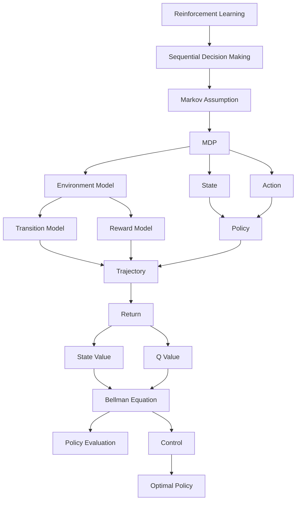
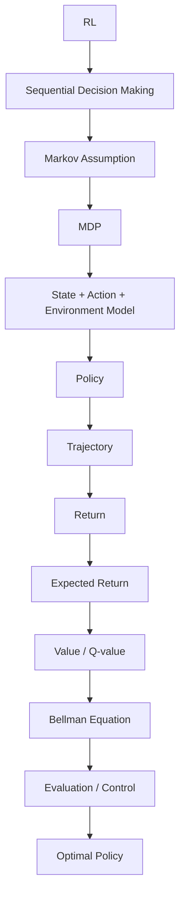

{: .shadow .rounded-10 }

## 3. Sequential Decision Making

The first important characteristic of RL is that decisions are **sequential**.

An action taken now affects the state in which the agent will make its next decision.

For example:

`Current State ↓ Choose Right ↓ Next State ↓ Choose Right/Left ↓ Next State`

Mathematically:

$$
S\_t,A\_t \rightarrow S\_{t+1} \rightarrow A\_{t+1} \rightarrow S\_{t+2}
$$

Therefore, an action cannot always be evaluated only by its immediate reward.

An action that produces a small reward now might lead to a state that produces a much larger reward later.

This is the origin of the **long-term planning problem** in RL.

---

## 4. History, Observation, and State

Before defining an MDP, we need to distinguish three concepts.

## History

The complete sequence of information available up to time $t$ can be represented as:

$$
H\_t = (A\_0,O\_0,R\_1,\ldots,A\_{t-1},O\_t,R\_t)
$$

Conceptually:

`Past ↓ Action ↓ Observation ↓ Reward ↓ Action ↓ Observation ↓ Current time`

The history can potentially contain a huge amount of information.

---

## Observation

An observation is what the agent currently receives from the environment.

We can denote it as:

$$
O\_t
$$

Examples include:

- camera image
- sensor reading
- current position
- current temperature
- customer search query

An observation does **not necessarily contain everything relevant about the environment**.

---

## State

The state is the representation used to describe the current situation:

$$
S\_t=f(H\_t)
$$

Ideally, the state should preserve all information from the history that is relevant for predicting the future.

This leads directly to the **Markov property**.

---

## 5. The Markov Property

The most important question is:

> **Does the current state contain enough information about the past to predict the future?**

If yes, the state is Markov.

Formally:

$$
\boxed{ P(S\_{t+1}\mid S\_t,A\_t,H\_t) = P(S\_{t+1}\mid S\_t,A\_t) }
$$

In words:

> Once we know the current state and action, knowing the entire history does not provide additional information about the distribution of the next state.

Another way to think about it:

$$
\boxed{ \text{Future is independent of the past given the present state.} }
$$

The state is therefore a **sufficient statistic of the history**.

---

## 6. A Real-World Example Where the State Is Not Markov

Consider an autonomous car.

Suppose we define the state as:

$$
S\_t=\text{current position}
$$

The car is currently:

$$
100\text{ meters from an intersection}
$$

Now consider two situations.

### Scenario A

`Position = 100 m Velocity = 80 km/h`

### Scenario B

`Position = 100 m Velocity = 20 km/h`

If the state contains only:

$$
S\_t=100m
$$

then both situations have the **same state representation**.

But their futures are clearly different.

The velocity contains information about what will happen next.

Therefore:

$$
P(S\_{t+1}\mid S\_t,A\_t,H\_t) \neq P(S\_{t+1}\mid S\_t,A\_t)
$$

for this state representation.

So:

$$
\boxed{ S\_t=\text{position} }
$$

is not a sufficient Markov state.

---

## 7. How Can We Fix a Non-Markov State?

Add the missing information.

Instead of:

$$
S\_t=\text{position}
$$

we can define:

$$
\boxed{ S\_t=(\text{position},\text{velocity}) }
$$

Now two situations such as:

$$
(100m,80km/h)
$$

and:

$$
(100m,20km/h)
$$

are represented differently.

The important lesson is:

> **Whether a representation is Markov depends on what information we include in the state.**

It is therefore more precise to say:

> “Our current state representation is not Markov.”

rather than simply:

> “The environment is non-Markov.”

---

## 8. Another Example: Customer Search

Suppose we want to build an RL system that recommends products to a customer.

We define:

$$
S\_t=\text{current search query}
$$

Two customers both search:

> running shoes

Therefore:

$$
S\_t=\text{"running shoes"}
$$

for both customers.

But their histories may be very different.

### Customer A

`Searched running shoes 10 times Viewed many products Added products to cart Compared prices`

### Customer B

`Searched running shoes once No previous interaction`

If this history affects the probability of a purchase tomorrow, then the current query alone is not a sufficient state.

A richer state might be:

$$
S\_t= ( \text{query}, \text{recent interactions}, \text{cart status}, \text{purchase history}, \ldots )
$$

The goal is not necessarily to preserve **all** history.

The goal is to preserve the **relevant information from history**.

---

## 9. Why the Markov Property Matters

Why do we care so much about the Markov property?

Because it allows us to summarize the past using a compact state.

Instead of reasoning about:

$$
P(S\_{t+1}\mid H\_t,A\_t)
$$

where $H\_t$ can become arbitrarily long, we can reason about:

$$
\boxed{ P(S\_{t+1}\mid S\_t,A\_t) }
$$

This is dramatically easier to model.

It is one of the fundamental assumptions behind the MDP framework.

---

## 10. Markov Process

We can now build the mathematical framework step by step.

Start with a **Markov Process**.

A Markov Process contains:

$$
(S,P)
$$

where:

- $S$ = set of states
- $P$ = transition probabilities

There are no actions and no rewards yet.

For example:

`s₀ ──0.8──→ s₁ │ └──0.2──→ s₂`

The transition probability is:

$$
P(s'|s)
$$

which tells us the probability of moving from $s$ to $s’$.

---

## 11. Markov Reward Process

Now add rewards.

A **Markov Reward Process (MRP)** consists conceptually of:

$$
\boxed{ (S,P,R,\gamma) }
$$

We now have:

- States
- Transition probabilities
- Rewards
- Discount factor

But there are still **no actions**.

The transition happens according to the environment dynamics.

---

## 12. Markov Decision Process

Now add actions.

An MDP can be represented as:

$$
\boxed{ M=(S,A,P,R,\gamma) }
$$

where:

| Symbol | Meaning |
| ------ | ------- |
| $S$           | Set of states    |
| $A$           | Set of actions   |
| $P$           | Transition model |
| $R$           | Reward model     |
| $\gamma$      | Discount factor  |

This is the mathematical foundation for the rest of RL.

---

## 13. State $S$

The state answers:

> **What situation is the agent currently in?**

For our robot:

$$
S=\\{s\_0,s\_1,s\_2,s\_3,s\_4\\}
$$

For example:

`s₀ = left side of room s₁ = position 1 s₂ = position 2 s₃ = position 3 s₄ = charging station`

The state representation should ideally satisfy the Markov property.

---

## 14. Action $A$

The action answers:

> **What can the agent choose to do?**

For the robot:

$$
A=\\{\text{Left},\text{Right}\\}
$$

At time $t$:

$$
A\_t\in A
$$

The distinction is important:

> **State = what situation the agent is in.**

> **Action = what the agent chooses to do.**

---

## 15. Transition Model

The transition model describes what happens after an action.

It is represented as:

$$
\boxed{ P(s'|s,a) }
$$

This means:

> Probability of transitioning to state $s’$ given that the current state is $s$ and action $a$ was taken.

For example:

$$
P(s\_4|s\_3,\text{Right})=0.8
$$

means that if the robot is at $s\_3$ and moves right, there is an 80% probability that it reaches $s\_4$.

There might also be:

$$
P(s\_2|s\_3,\text{Right})=0.2
$$

representing an 80/20 stochastic transition.

The transition probabilities for a particular $(s,a)$ must satisfy:

$$
\sum\_{s'}P(s'|s,a)=1
$$

---

## 16. Reward Model

The reward tells us how good or bad a transition is.

The reward can depend on the:

- current state
- action
- next state

and is often represented as:

$$
R(s,a,s')
$$

For example:

`Move normally → 0 Reach charging → +10 Fall into obstacle → -10`

The reward model can also be written as an expected immediate reward:

$$
R(s,a) = E[r\_t|s\_t=s,a\_t=a]
$$

The important distinction is:

`Transition model: Where do I go? Reward model: How good/bad is what happened?`

---

## 17. Model = Transition + Reward

Therefore, the model of an MDP can be thought of as:

`Model │ ├── Transition / Dynamics │ P(s' | s,a) │ └── Reward R(s,a,s')`

The model describes the environment.

This distinction becomes important later when we study:

- model-based RL
- model-free RL
- planning
- learning from environment interaction

---

## 18. Policy $\pi$

The MDP describes the environment, but we still need to describe the **agent’s behavior**.

That is the policy.

A policy answers:

> **Given the current state, what action should I take?**

A deterministic policy is:

$$
\boxed{ \pi(s)=a }
$$

For example:

$$
\pi(s\_0)=\text{Right}
$$

A stochastic policy is represented as:

$$
\boxed{ \pi(a|s)=P(A\_t=a|S\_t=s) }
$$

For example:

$$
\pi(\text{Right}|s\_0)=0.8
$$

and:

$$
\pi(\text{Left}|s\_0)=0.2
$$

The probabilities satisfy:

$$
\sum\_a\pi(a|s)=1
$$

---

## 19. Policy Generates a Trajectory

Once we have an MDP and a policy, the agent can interact with the environment.

At state $s\_t$:

$$
A\_t\sim\pi(\cdot|s\_t)
$$

Then the environment transitions:

$$
S\_{t+1}\sim P(\cdot|s\_t,a\_t)
$$

and produces a reward:

$$
R\_{t+1}
$$

So the interaction looks like:

`Current state sₜ │ │ π(a|sₜ) ▼ Action aₜ │ │ P(s'|sₜ,aₜ) ▼ Next state sₜ₊₁ │ ▼ Reward`

Repeating this generates a trajectory:

$$
\tau= (s\_0,a\_0,r\_1,s\_1,a\_1,r\_2,\ldots)
$$

---

## 20. Return $G\_t$

Now we need a way to measure how successful a trajectory was.

The **return** is the cumulative discounted future reward.

$$
\boxed{ G\_t= R\_{t+1} +\gamma R\_{t+2} +\gamma^2R\_{t+3} +\cdots }
$$

The discount factor satisfies:

$$
0\leq\gamma\leq1
$$

If:

$$
\gamma\approx0
$$

the agent cares mostly about immediate rewards.

If:

$$
\gamma\approx1
$$

future rewards matter much more.

---

## 21. Numerical Example of Return

Suppose:

$$
R\_1=0
$$ $$
R\_2=10
$$

and:

$$
\gamma=0.9
$$

Then:

$$
G\_0 = 0+0.9(10)
$$

Therefore:

$$
\boxed{ G\_0=9 }
$$

The reward of $10$ is received one step in the future, so it gets multiplied by $\gamma$.

---

## 22. Why Discounting Exists

Suppose two strategies produce the same reward:

### Strategy A

$$
+10
$$

immediately.

### Strategy B

$$
0,0,0,+10
$$

after several steps.

With discounting, Strategy A is preferred because the reward arrives sooner.

Discounting therefore captures the idea that:

> **Rewards received sooner can be more valuable than rewards received later.**

---

## 23. Value Function $V^\pi(s)$

A return corresponds to a particular trajectory.

But in a stochastic environment, different trajectories can occur.

So instead of asking:

> What return did this particular trajectory produce?

we ask:

> **If I start in state $s$ and follow policy $\pi$, what return do I expect?**

This is the state-value function:

$$
\boxed{ V^\pi(s) = E\_\pi[G\_t|S\_t=s] }
$$

Think of it as:

> **How good is it to be in state $s$ if I follow policy $\pi$?**

---

## 24. Q-Value $Q^\pi(s,a)$

The value function does not specify an action.

The Q-function does.

$$
\boxed{ Q^\pi(s,a) = E\_\pi[G\_t|S\_t=s,A\_t=a] }
$$

It asks:

> **If I am in state $s$, take action $a$ now, and then follow policy $\pi$, what return do I expect?**

Therefore:

### Value function

$$
V^\pi(s)
$$

means:

> How good is this state?

### Q-function

$$
Q^\pi(s,a)
$$

means:

> How good is this action from this state?

---

## 25. Relationship Between $V^\pi$ and $Q^\pi$

The policy chooses actions according to:

$$
\pi(a|s)
$$

Therefore the state value is the policy-weighted average of the Q-values:

$$
\boxed{ V^\pi(s) = \sum\_a \pi(a|s)Q^\pi(s,a) }
$$

For a deterministic policy:

$$
\pi(s)=a^\*
$$

we get:

$$
\boxed{ V^\pi(s)=Q^\pi(s,a^\*) }
$$

This relationship is extremely important.

---

## 26. Example: Connecting $V$ and $Q$

Suppose at state $A$:

`A / \ Left Right ↓ ↓ +5 B ↓ +10`

Let:

$$
\gamma=0.9
$$

Then:

$$
Q^\pi(A,\text{Left})=5
$$

because the reward is immediate.

For Right:

$$
Q^\pi(A,\text{Right})=0+0.9(10)=9
$$

Now suppose the policy is:

$$
\pi(\text{Left}|A)=0.3
$$ $$
\pi(\text{Right}|A)=0.7
$$

Then:

$$
V^\pi(A) = 0.3(5)+0.7(9)
$$ $$
\boxed{ V^\pi(A)=7.8 }
$$

The value of the state is therefore determined by **both**:

- how good each action is
- how likely the policy is to choose each action

---

## 27. Bellman Equation

The Bellman equation is one of the central ideas in RL.

Start with the definition of return:

$$
G\_t= R\_{t+1} +\gamma R\_{t+2} +\gamma^2R\_{t+3} +\cdots
$$

We can split this into:

$$
G\_t = R\_{t+1} + \gamma \left( R\_{t+2} +\gamma R\_{t+3} +\cdots \right)
$$

The expression in parentheses is simply the return from the next time step:

$$
G\_{t+1}
$$

Therefore:

$$
\boxed{ G\_t=R\_{t+1}+\gamma G\_{t+1} }
$$

This simple identity is the foundation of the Bellman equations.

---

## 28. Bellman Equation for an MRP

For an MRP, the value equation is:

$$
\boxed{ V(s) = R(s) + \gamma \sum\_{s'} P(s'|s)V(s') }
$$

Read this as:

$$
\boxed{ \text{Current Value} = \text{Immediate Reward} + \text{Discounted Expected Future Value} }
$$

This is the core intuition behind Bellman equations.

---

## 29. Bellman Equation for an MDP Under Policy $\pi$

Now introduce actions and a policy.

The agent chooses action $a$ according to:

$$
\pi(a|s)
$$

The environment then transitions to $s’$ according to:

$$
P(s'|s,a)
$$

Therefore:

$$
\boxed{ V^\pi(s) = \sum\_a \pi(a|s) \sum\_{s'} P(s'|s,a) \left[ R(s,a,s') + \gamma V^\pi(s') \right] }
$$

This equation can look intimidating, but it is just the RL interaction written mathematically.

Read it from inside outward:

`R(s,a,s') + γ Vπ(s') ↓ Reward + future value weighted by: P(s' | s,a) ↓ Which next state occurs? weighted by: π(a | s) ↓ Which action does the policy choose?`

Therefore:

$$
\boxed{ V^\pi(s) = \text{policy-weighted expected reward + future value} }
$$

---

## 30. Bellman Equation in Terms of $Q^\pi$

First define:

$$
Q^\pi(s,a) = \sum\_{s'} P(s'|s,a) \left[ R(s,a,s') + \gamma V^\pi(s') \right]
$$

Then:

$$
V^\pi(s) = \sum\_a \pi(a|s)Q^\pi(s,a)
$$

Combining the two gives:

$$
\boxed{ V^\pi(s) = \sum\_a\pi(a|s) \sum\_{s'} P(s'|s,a) \left[ R(s,a,s') + \gamma V^\pi(s') \right] }
$$

This is one of the most important equations to understand from the first lecture.

---

## 31. Policy Evaluation

Once we have a policy $\pi$, we can ask:

> **How good is this policy?**

This is called **policy evaluation**.

The goal is to calculate:

$$
\boxed{ V^\pi(s) }
$$

for the states in the MDP.

The key distinction is:

`Evaluation: Given π ↓ How good is π? ↓ Vπ`

We are **not yet trying to change the policy**.

---

## 32. Control

Now ask a different question:

> **What is the best policy?**

This is the **control problem**.

We want:

$$
\boxed{ \pi^\* }
$$

such that:

$$
V^{\pi^\*}(s) \geq V^\pi(s)
$$

for all policies $\pi$.

Equivalently:

$$
\boxed{ V^\*(s) = \max\_\pi V^\pi(s) }
$$

The optimal Q-function is:

$$
Q^\*(s,a)
$$

and represents the best possible expected return after taking action $a$ in state $s$ and acting optimally afterward.

---

## 33. Bellman Optimality Equation

The Bellman expectation equation says:

> Follow the given policy.

The Bellman optimality equation says:

> **Choose the best action.**

Therefore:

$$
\boxed{ V^\*(s) = \max\_a \sum\_{s'} P(s'|s,a) \left[ R(s,a,s') + \gamma V^\*(s') \right] }
$$

Compare the two equations.

### Policy evaluation

$$
V^\pi(s) = \sum\_a \pi(a|s) \sum\_{s'} P(s'|s,a) [ R+\gamma V^\pi(s') ]
$$

### Optimality

$$
V^\*(s) = \max\_a \sum\_{s'} P(s'|s,a) [ R+\gamma V^\*(s') ]
$$

The major conceptual difference is:

$$
\boxed{ \text{Policy: average according to }\pi }
$$

versus:

$$
\boxed{ \text{Optimality: take the maximum} }
$$

---

## 34. The Complete RL Picture

At this point, we can reconstruct the entire conceptual flow.



The entire diagram can be read as:




## 35. Model-Based vs Model-Free RL

Another important distinction is whether the agent explicitly has a model of the environment.

## Model-Based

The agent has or learns:

$$
P(s'|s,a)
$$

and:

$$
R(s,a)
$$

It can use this model for planning.

`Model ↓ Predict consequences ↓ Plan ↓ Choose action`

---

## Model-Free

The agent does not explicitly maintain the environment model.

Instead, it learns things such as:

$$
V(s)
$$ $$
Q(s,a)
$$

and/or:

$$
\pi(a|s)
$$

`Experience ↓ Learn value / policy ↓ Choose action`

An important point is that **model-based/model-free** and **value-based/policy-based** are different dimensions.

They should not be treated as the same classification.

---

## 36. Why RL Is Different From Supervised Learning

The first lecture highlights several characteristics that make RL distinctive.

## 36.1 Delayed Consequences

An action can have consequences much later.

For example:

`Action at t=1 ↓ State at t=2 ↓ Action at t=3 ↓ ... ↓ Reward at t=20`

This creates the **temporal credit assignment problem**:

> Which earlier actions were responsible for the eventual reward?

---

## 36.2 Exploration

The agent has to decide:

> Should I exploit what I already believe is good, or explore something uncertain?

This is fundamentally different from supervised learning because the agent’s actions influence the data it observes.

If the agent chooses action $A$, it observes what happens after $A$, but it does not simultaneously observe what would have happened if it had chosen $B$.

This introduces a **counterfactual** aspect to RL.

---

## 36.3 Generalization

The agent should ideally learn a decision-making rule that generalizes across states rather than memorizing a fixed action for every possible situation.

This becomes especially important when the state space is large or continuous.

---

## 37. Reward Design Matters

One important lesson from RL is:

> **The agent optimizes the reward that we specify, not necessarily the goal that we intended.**

Consider an AI tutor.

Suppose the tutor receives:

$$
+1
$$

whenever a student answers a question correctly.

The tutor’s objective becomes:

$$
\max E[\text{correct answers}]
$$

But this does not necessarily mean:

$$
\max E[\text{student learning}]
$$

The tutor might discover that asking very easy questions produces many correct answers.

It can therefore maximize the specified reward while failing to achieve the intended objective.

This is an important motivation for careful **reward design** and becomes especially relevant when we later study **RLHF and reward modeling**.

---

## 38. A Practical Way to Formulate an RL Problem

Whenever you are given a new real-world problem, use this checklist.

## Step 1: What is the state?

Ask:

> What information describes the current situation and is sufficient for predicting the future?

Write:

$$
S\_t=?
$$

---

## Step 2: What are the actions?

Ask:

> What decisions can the agent make?

Write:

$$
A=?
$$

---

## Step 3: What is the transition model?

Ask:

> If I take action $a$ in state $s$, what can happen next?

Write:

$$
P(s'|s,a)
$$

---

## Step 4: What is the reward?

Ask:

> How do I quantify whether the outcome was good or bad?

Write:

$$
R(s,a,s')
$$

---

## Step 5: What is the policy?

Ask:

> How does the agent choose actions?

Write:

$$
\pi(a|s)
$$

---

## Step 6: What is the return?

Ask:

> How much future reward do I care about?

Write:

$$
G\_t= R\_{t+1} +\gamma R\_{t+2} +\gamma^2R\_{t+3} +\cdots
$$

---

## Step 7: What is the value?

Ask:

> What return do I expect from this state?

Write:

$$
V^\pi(s) = E\_\pi[G\_t|S\_t=s]
$$

---

## Step 8: What is the Q-value?

Ask:

> What return do I expect if I specifically take action $a$ now?

Write:

$$
Q^\pi(s,a) = E\_\pi[G\_t|S\_t=s,A\_t=a]
$$

---

## 39. The Most Important Equations From Lecture 1

If I had to reduce the entire lecture to a small mathematical sheet, I would keep these.

### Markov Property

$$
\boxed{ P(S\_{t+1}|S\_t,A\_t,H\_t) = P(S\_{t+1}|S\_t,A\_t) }
$$

### MDP

$$
\boxed{ M=(S,A,P,R,\gamma) }
$$

### Policy

$$
\boxed{ \pi(a|s)=P(A\_t=a|S\_t=s) }
$$

### Return

$$
\boxed{ G\_t= R\_{t+1} +\gamma R\_{t+2} +\gamma^2R\_{t+3} +\cdots }
$$

### State Value

$$
\boxed{ V^\pi(s) = E\_\pi[G\_t|S\_t=s] }
$$

### Action Value

$$
\boxed{ Q^\pi(s,a) = E\_\pi[G\_t|S\_t=s,A\_t=a] }
$$

### Relationship Between $V$ and $Q$

$$
\boxed{ V^\pi(s) = \sum\_a\pi(a|s)Q^\pi(s,a) }
$$

### Bellman Expectation Equation

$$
\boxed{ V^\pi(s) = \sum\_a\pi(a|s) \sum\_{s'} P(s'|s,a) \left[ R(s,a,s') + \gamma V^\pi(s') \right] }
$$

### Bellman Optimality Equation

$$
\boxed{ V^\*(s) = \max\_a \sum\_{s'} P(s'|s,a) \left[ R(s,a,s') + \gamma V^\*(s') \right] }
$$

---

## 40. The Big Picture

At first, these equations can look like independent definitions.

They aren’t.

They form one chain:

$$
\boxed{ \text{MDP} \rightarrow \text{Policy} \rightarrow \text{Trajectory} \rightarrow \text{Return} \rightarrow \text{Value} \rightarrow \text{Bellman Equation} \rightarrow \text{Evaluation} \rightarrow \text{Control} }
$$

Or, in plain English:

> **Describe the world → decide how to act → experience trajectories → measure the resulting rewards → estimate how good states/actions are → recursively reason about those values → evaluate policies → improve them toward an optimal policy.**

Once this chain is clear, algorithms such as **Dynamic Programming, Monte Carlo, TD Learning, SARSA, Q-learning, Policy Gradient, Actor-Critic, and PPO** stop looking like unrelated algorithms.

They become different ways of solving different parts of the same underlying problem.

---


## 41. Final Mental Model

The entire first lecture can be remembered as one chain:

```text
                    REINFORCEMENT LEARNING
                             │
                             ▼
                   Sequential Decision Making
                             │
                             ▼
                      Markov Assumption
                             │
                             ▼
                            MDP
                             │
                ┌────────────┼────────────┐
                │            │            │
                ▼            ▼            ▼
             State         Action       Model
                                           │
                                 ┌─────────┴─────────┐
                                 ▼                   ▼
                            Transition            Reward
                            P(s'|s,a)             R(s,a,s')
                                 │                   │
                                 └─────────┬─────────┘
                                           ▼
                                         Policy
                                         π(a|s)
                                           │
                                           ▼
                                       Trajectory
                                           │
                                           ▼
                                         Return
                                           Gₜ
                                           │
                              ┌────────────┴────────────┐
                              ▼                         ▼
                           Vπ(s)                     Qπ(s,a)
                              │                         │
                              └────────────┬────────────┘
                                           ▼
                                    Bellman Equation
                                           │
                                ┌──────────┴──────────┐
                                ▼                     ▼
                            Evaluation              Control
                                                        │
                                                        ▼
                                                 Optimal Policy π*
```

The core idea is:

> **An MDP describes the decision-making world. A policy determines what the agent does. A trajectory produces rewards. The return measures the outcome. Value functions estimate expected return. Bellman equations decompose that value into immediate reward and future value. Policy evaluation asks how good a policy is; control asks how to improve it.**
> {: .prompt-info }

Once this chain is clear, algorithms such as **Dynamic Programming, Monte Carlo, TD Learning, SARSA, Q-learning, Policy Gradient, Actor-Critic, and PPO** stop looking like unrelated algorithms.

They become different ways of solving different parts of the same underlying problem.
