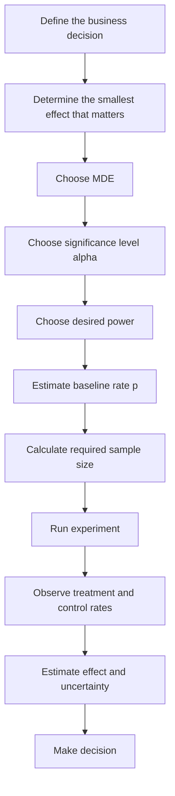
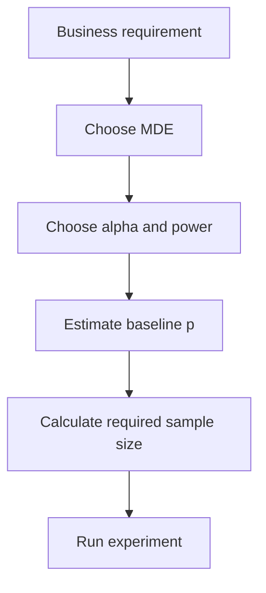

---
categories:
- Statistics
- A/B Testing
date: "2026-10-07 09:00:00 +0530"
math: true
mermaid: true
tags:
- ab-testing
- mde
- hypothesis-testing
- statistical-power
- central-limit-theorem
title: Understanding MDE in A/B Testing From First Principles
toc: true
---

 {:
.shadow .rounded-10 }

When reading about **A/B testing**, it is easy to encounter a collection
of formulas for sample size, standard error, p-values, confidence
intervals, statistical power, and **Minimum Detectable Effect (MDE)**.

The formulas themselves are not particularly difficult.

The harder question is:

> Why do these quantities exist, and how does one follow mathematically
> from another?

In this article, we will build the theory in the same way we might build
a theory in mathematics: introduce definitions only when they become
necessary, and derive each new result from what we have already
established.

By the end, we will understand why

$$
MDE \approx 2.8SE
$$

appears so often in A/B testing with 5% significance and 80% power.

More importantly, we will understand what that statement actually means.

------------------------------------------------------------------------

## 1. Start With an Observation

Suppose we are running an A/B test where the outcome is whether a user
makes a purchase.

For each user, define:

$$
X =
\begin{cases}
1, & \text{if the user purchases} \\
0, & \text{otherwise}
\end{cases}
$$

The important point is that $X$ is random.

Two users can see the same experience and behave differently.

For Control users, write:

$$
X_{C,1},X_{C,2},\ldots,X_{C,n_C}
$$

and for Treatment users:

$$
X_{T,1},X_{T,2},\ldots,X_{T,n_T}.
$$

Our goal is to determine whether the Treatment changes purchase behavior
relative to Control.

To do that, we first need a way to describe the center of these random
variables.

------------------------------------------------------------------------

## 2. Definition: Mean

For a random variable $X$, define its mean as:

$$
\mu = E[X].
$$

For our purchase variable:

$$
X \in \{0,1\}.
$$

Therefore:

$$
E[X]
=
0\cdot P(X=0)
+
1\cdot P(X=1).
$$

Hence:

$$
E[X] = P(X=1).
$$

So for purchase data:

$$
\boxed{
\mu = P(\text{purchase})
}
$$

For Control, define:

$$
p_C = E[X_C].
$$

For Treatment:

$$
p_T = E[X_T].
$$

Therefore:

$$
p_C = P(\text{purchase}\mid C)
$$

and:

$$
p_T = P(\text{purchase}\mid T).
$$

These are the **true population purchase probabilities**.

They exist, but we do not know them.

------------------------------------------------------------------------

## 3. Definition: Sample Mean

We cannot observe every possible user.

Instead, we observe a finite sample.

For observations:

$$
X_1,X_2,\ldots,X_n,
$$

define the sample mean:

$$
\bar X_n
=
\frac{1}{n}
\sum_{i=1}^{n}X_i.
$$

For binary purchase data, this becomes:

$$
\bar X_n
=
\frac{\text{number of purchases}}
{\text{number of users}}.
$$

So for Control:

$$
\hat p_C = \bar X_C
$$

and for Treatment:

$$
\hat p_T = \bar X_T.
$$

We should keep an important distinction in mind:

$$
p_C,\;p_T
$$

are the unknown **true population probabilities**, while:

$$
\hat p_C,\;\hat p_T
$$

are the **observed sample probabilities**.

For example, the true Control purchase rate might be:

$$
p_C=2.00\%.
$$

But one experiment might observe:

$$
\hat p_C=2.03\%.
$$

Another experiment might observe:

$$
\hat p_C=1.98\%.
$$

The population parameter remains fixed.

The sample estimate fluctuates.

------------------------------------------------------------------------

## 4. Definition: Variance

Knowing only the mean is not enough.

Two random variables can have the same mean while having very different
amounts of randomness.

We therefore define variance.

For a random variable $X$:

$$
Var(X)
=
E[(X-E[X])^2].
$$

Let:

$$
E[X]=\mu.
$$

Then:

$$
Var(X)
=
E[(X-\mu)^2].
$$

Expanding:

$$
Var(X)
=
E[X^2-2\mu X+\mu^2].
$$

Using linearity of expectation:

$$
Var(X)
=
E[X^2]
-
2\mu E[X]
+
\mu^2.
$$

Since:

$$
E[X]=\mu,
$$

we obtain:

$$
\boxed{
Var(X)
=
E[X^2]-\mu^2
}
$$

------------------------------------------------------------------------

## 5. Variance of Purchase Data

For our purchase variable:

$$
X\in\{0,1\}.
$$

Therefore:

$$
X^2=X.
$$

Hence:

$$
E[X^2]=E[X]=p.
$$

Using the variance identity:

$$
Var(X)
=
E[X^2]-E[X]^2,
$$

we get:

$$
Var(X)
=
p-p^2.
$$

Therefore:

$$
\boxed{
Var(X)=p(1-p)
}
$$

For Control:

$$
Var(X_C)=p_C(1-p_C)
$$

and for Treatment:

$$
Var(X_T)=p_T(1-p_T).
$$

------------------------------------------------------------------------

## 6. The Law of Large Numbers

We now have a true population mean $p$ and an observed sample mean
$\hat p$.

The obvious question is:

> Why should we believe that the observed sample mean tells us anything
> about the true population mean?

This is where the **Law of Large Numbers** enters.

### Theorem: Law of Large Numbers

Suppose:

$$
X_1,X_2,\ldots
$$

are independent and identically distributed random variables with finite
expectation:

$$
E[X_i]=\mu.
$$

Then:

$$
\boxed{
\bar X_n
\xrightarrow{P}
\mu
}
$$

as:

$$
n\rightarrow\infty.
$$

Informally:

> As the number of observations becomes large, the sample mean becomes
> increasingly close to the true population mean.

Therefore, for our A/B test:

$$
\hat p_C
\xrightarrow{P}
p_C
$$

and:

$$
\hat p_T
\xrightarrow{P}
p_T.
$$

> The Law of Large Numbers tells us **where the sample mean goes**, but
> not the shape of the error around the true mean. {: .prompt-info }

------------------------------------------------------------------------

## 7. Variance of the Sample Mean

Consider:

$$
\bar X_n
=
\frac{1}{n}
\sum_{i=1}^{n}X_i.
$$

Using:

$$
Var(aX)=a^2Var(X),
$$

and independence:

$$
Var\left(\sum_{i=1}^{n}X_i\right)
=
\sum_{i=1}^{n}Var(X_i),
$$

we obtain:

$$
Var(\bar X_n)
=
\frac{1}{n^2}(n\sigma^2).
$$

Therefore:

$$
\boxed{
Var(\bar X_n)
=
\frac{\sigma^2}{n}
}
$$

and:

$$
\boxed{
SD(\bar X_n)
=
\frac{\sigma}{\sqrt n}.
}
$$

As $n\rightarrow\infty$:

$$
Var(\bar X_n)\rightarrow0.
$$

The population itself does not become less variable. Our estimate of its
mean becomes more stable.

------------------------------------------------------------------------

## 8. The Central Limit Theorem

The Law of Large Numbers tells us:

$$
\bar X_n\rightarrow\mu.
$$

But we now want to know how $\bar X_n$ fluctuates around $\mu$.

### Theorem: Central Limit Theorem

Suppose $X_1,X_2,\ldots$ are i.i.d. with:

$$
E[X_i]=\mu
$$

and:

$$
Var(X_i)=\sigma^2<\infty.
$$

Then:

$$
\boxed{
\frac{\bar X_n-\mu}{\sigma/\sqrt n}
\xrightarrow{d}
N(0,1)
}
$$

as $n\rightarrow\infty$.

Equivalently, for sufficiently large $n$:

$$
\boxed{
\bar X_n
\approx
N\left(
\mu,
\frac{\sigma^2}{n}
\right)
}
$$

> LLN tells us where the estimator goes. CLT tells us how it fluctuates
> around that destination. {: .prompt-tip }

------------------------------------------------------------------------

## 9. Applying the CLT to Control and Treatment

For Control:

$$
\boxed{
\hat p_C
\approx
N\left(
p_C,
\frac{p_C(1-p_C)}{n_C}
\right)
}
$$

For Treatment:

$$
\boxed{
\hat p_T
\approx
N\left(
p_T,
\frac{p_T(1-p_T)}{n_T}
\right)
}
$$

We now know approximately how the observed Control and Treatment
purchase rates behave.

But an A/B test cares primarily about their difference.

------------------------------------------------------------------------

## 10. Definition: The Treatment Effect

Define the true treatment effect:

$$
\boxed{
\Delta=p_T-p_C
}
$$

We cannot observe $\Delta$ directly.

Instead define the observed difference:

$$
\boxed{
D=\hat p_T-\hat p_C
}
$$

The true effect $\Delta$ is fixed but unknown.

The observed effect $D$ is random.

------------------------------------------------------------------------

## 11. Distribution of the Observed Difference

By linearity of expectation:

$$
E[D]
=
E[\hat p_T]-E[\hat p_C].
$$

Therefore:

$$
\boxed{
E[D]=p_T-p_C=\Delta
}
$$

Assuming independently randomized groups:

$$
Var(D)
=
Var(\hat p_T)+Var(\hat p_C).
$$

Hence:

$$
\boxed{
Var(D)
=
\frac{p_T(1-p_T)}{n_T}
+
\frac{p_C(1-p_C)}{n_C}
}
$$

Therefore, by the CLT:

$$
\boxed{
D
\approx
N\left(
\Delta,
\frac{p_T(1-p_T)}{n_T}
+
\frac{p_C(1-p_C)}{n_C}
\right)
}
$$

This is the central distribution underlying the A/B test.

------------------------------------------------------------------------

## 12. Definition: Standard Error

We repeatedly need the standard deviation of the sampling distribution
of $D$.

Define:

$$
\boxed{
SE(D)
=
\sqrt{
\frac{p_T(1-p_T)}{n_T}
+
\frac{p_C(1-p_C)}{n_C}
}
}
$$

The standard error tells us how much the observed Treatment-Control
difference naturally fluctuates because of random sampling.

------------------------------------------------------------------------

## 13. The Null Hypothesis

### Definition: Null Hypothesis

Define:

$$
\boxed{
H_0:p_T=p_C
}
$$

Equivalently:

$$
\boxed{
H_0:\Delta=0
}
$$

Under the null:

$$
E[D]=0.
$$

Therefore:

$$
\boxed{
D\mid H_0
\approx
N(0,SE_0^2)
}
$$

This is the **null distribution**.

------------------------------------------------------------------------

## 14. Estimating the Unknown Variance

The standard error contains the unknown probabilities $p_C$ and $p_T$.

By the Law of Large Numbers:

$$
\hat p_C\xrightarrow{P}p_C
$$

and:

$$
\hat p_T\xrightarrow{P}p_T.
$$

Therefore we can estimate the standard error using:

$$
\boxed{
\widehat{SE}
=
\sqrt{
\frac{\hat p_T(1-\hat p_T)}{n_T}
+
\frac{\hat p_C(1-\hat p_C)}{n_C}
}
}
$$

For large samples, this consistently estimates the unknown standard
error.

------------------------------------------------------------------------

## 15. Why We Sometimes Pool the Purchase Rate

Under the null:

$$
p_T=p_C=p.
$$

Therefore:

$$
Var(D)
=
p(1-p)
\left(
\frac{1}{n_T}
+
\frac{1}{n_C}
\right).
$$

The common $p$ is unknown.

Under the null model, all Control and Treatment observations share the
same Bernoulli parameter, so estimate it using:

$$
\boxed{
\hat p_{pool}
=
\frac{x_T+x_C}{n_T+n_C}
}
$$

Then:

$$
\boxed{
SE_0
=
\sqrt{
\hat p_{pool}(1-\hat p_{pool})
\left(
\frac{1}{n_T}
+
\frac{1}{n_C}
\right)
}
}
$$

> Pooling does not claim that the observed Treatment and Control rates
> are equal. It estimates the common probability in the hypothetical
> world described by the null hypothesis. {: .prompt-info }

------------------------------------------------------------------------

## 16. Measuring How Far Apart the Groups Are

Under $H_0$:

$$
D\approx N(0,SE_0^2).
$$

Standardizing:

$$
\boxed{
Z=\frac{D}{SE_0}
}
$$

or:

$$
\boxed{
Z=
\frac{\hat p_T-\hat p_C}{SE_0}
}
$$

Under the null:

$$
Z\approx N(0,1).
$$

So $Z$ tells us how many standard errors away from zero the observed
Treatment-Control difference is.

------------------------------------------------------------------------

## 17. Statistical Significance

Suppose:

$$
\alpha=0.05.
$$

For a two-sided test, approximately 95% of the standard normal
distribution lies between:

$$
-1.96
$$

and:

$$
+1.96.
$$

Therefore we reject $H_0$ when:

$$
\boxed{
|Z|>1.96
}
$$

Equivalently:

$$
\boxed{
|D|>1.96SE_0
}
$$

If the true effect were zero, only about 5% of repeated experiments
would fall outside these boundaries.

------------------------------------------------------------------------

## 18. Definition: Statistical Power

Suppose the true effect is $\Delta\neq0$.

Then:

$$
D\approx N(\Delta,SE^2).
$$

Define power at effect $\Delta$ as:

$$
\boxed{
Power(\Delta)
=
P(\text{reject }H_0\mid\Delta)
}
$$

Power answers:

> If a particular true effect actually exists, what is the probability
> that our experiment produces a statistically significant result?

For example, 80% power means that if we repeatedly ran the same
experiment while the true effect remained fixed, approximately 80% of
those experiments would reject the null.

------------------------------------------------------------------------

## 19. The Alternative Distribution

Suppose:

$$
p_C=2.00\%
$$

and:

$$
p_T=1.95\%.
$$

Then:

$$
\Delta=-0.05\text{ percentage points}.
$$

Repeated experiments now produce:

$$
D
\approx
N(-0.05\text{ pp},SE^2).
$$

We therefore have two distributions:

$$
D\mid H_0\sim N(0,SE^2)
$$

and:

$$
D\mid \Delta=-0.05\sim N(-0.05,SE^2).
$$

Power is the portion of the alternative distribution lying inside the
rejection region.

------------------------------------------------------------------------

## 20. Why We Need MDE

Before running the experiment, we do not know the true effect $\Delta$,
but we must decide how much traffic to collect.

We therefore ask:

> What is the smallest true effect that we want this experiment to
> detect reliably?

Only now do we need MDE.

### Definition: Minimum Detectable Effect

For fixed significance level $\alpha$, desired power $1-\beta$, baseline
probability $p$, and sample size, the **Minimum Detectable Effect** is
the effect size for which the experiment achieves the desired
statistical power.

For example:

> An MDE of $0.05$ percentage points at 80% power means that if the true
> effect were $0.05$ percentage points, approximately 80% of repeated
> experiments would produce a statistically significant result.

> MDE is not the smallest effect that can ever become statistically
> significant. It is the effect size at which the experiment reaches the
> chosen power. {: .prompt-warning }

------------------------------------------------------------------------

## 21. Deriving the MDE Formula

For a two-sided test with:

$$
\alpha=0.05,
$$

the significance boundary is:

$$
1.96SE.
$$

For 80% power, the 80th percentile of the standard normal distribution
is approximately:

$$
0.84.
$$

For 80% of the alternative distribution to lie beyond the significance
boundary, the alternative mean must be approximately $0.84SE$ past that
boundary.

Therefore:

$$
MDE
=
1.96SE+0.84SE.
$$

Hence:

$$
\boxed{
MDE\approx2.8SE
}
$$

More generally:

$$
\boxed{
MDE
\approx
\left(
z_{1-\alpha/2}
+
z_{1-\beta}
\right)SE
}
$$

where $1-\beta$ is the desired power.

------------------------------------------------------------------------

## 22. Why 2.8?

The number $2.8$ is not arbitrary:

$$
2.8=1.96+0.84.
$$

The $1.96$ comes from the 5% two-sided significance requirement.

The $0.84$ comes from the 80% power requirement.

The MDE distribution is centered sufficiently far beyond the rejection
boundary that approximately 80% of it falls into the rejection region.

------------------------------------------------------------------------

## 23. MDE Is Not the Observed Effect

Suppose:

$$
MDE=0.05\text{ pp}.
$$

After running the experiment, we might observe:

$$
D=-0.03\text{ pp},
$$

or:

$$
D=-0.07\text{ pp},
$$

or:

$$
D=+0.01\text{ pp}.
$$

The MDE was never a prediction of what we would observe.

The three quantities are:

$$
\boxed{
\Delta=p_T-p_C
}
$$

the unknown true effect,

$$
\boxed{
D=\hat p_T-\hat p_C
}
$$

the observed effect, and MDE, the effect size for which the experiment
was designed to have a chosen level of power.

> The MDE curve is a design assumption. The true-effect curve is
> reality. Before running the experiment, we do not know where the
> true-effect curve is centered. {: .prompt-tip }

------------------------------------------------------------------------

## 24. Deriving Sample Size From MDE

For purchase data:

$$
SE
\approx
\sqrt{
p(1-p)
\left(
\frac{1}{n_T}
+
\frac{1}{n_C}
\right)
}.
$$

For equal allocation:

$$
n_T=n_C=n.
$$

Then:

$$
SE
=
\sqrt{
\frac{2p(1-p)}{n}
}.
$$

Using:

$$
MDE
=
\left(
z_{1-\alpha/2}
+
z_{1-\beta}
\right)SE,
$$

we obtain:

$$
MDE
=
\left(
z_{1-\alpha/2}
+
z_{1-\beta}
\right)
\sqrt{
\frac{2p(1-p)}{n}
}.
$$

Squaring and solving for $n$:

$$
\boxed{
n
\approx
\frac{
2p(1-p)
\left(
z_{1-\alpha/2}
+
z_{1-\beta}
\right)^2
}{
MDE^2
}
}
$$

This is approximately the required sample size **per experiment arm**.

------------------------------------------------------------------------

## 25. A Complete Numerical Example

Suppose the historical purchase rate is:

$$
p=2\%.
$$

We want to reliably detect:

$$
0.05\text{ percentage points}.
$$

Therefore:

$$
MDE=0.0005.
$$

Take:

$$
\alpha=0.05
$$

and:

$$
Power=80\%.
$$

Then:

$$
z_{1-\alpha/2}=1.96
$$

and:

$$
z_{1-\beta}=0.84.
$$

Therefore:

$$
n
\approx
\frac{
2(0.02)(0.98)(1.96+0.84)^2
}{
(0.0005)^2
}.
$$

Since:

$$
1.96+0.84=2.8,
$$

we obtain approximately:

$$
\boxed{
n\approx1.23\text{ million users per arm}
}
$$

------------------------------------------------------------------------

## 26. Why Smaller MDE Requires More Traffic

From the sample-size equation:

$$
n\propto\frac{1}{MDE^2}.
$$

If we halve the MDE:

$$
MDE_{new}=\frac{MDE_{old}}{2},
$$

then:

$$
n_{new}=4n_{old}.
$$

If we reduce MDE by a factor of ten:

$$
n_{new}=100n_{old}.
$$

This is why experiments designed to detect extremely small effects can
require enormous amounts of traffic.

------------------------------------------------------------------------

## 27. Choosing the Wrong MDE

Suppose an effect of:

$$
0.05\text{ pp}
$$

is economically important, but we design using:

$$
MDE=0.20\text{ pp}.
$$

The required sample becomes much smaller, but the experiment is powered
for the much larger effect. A real $0.05$ pp effect can frequently go
undetected.

This is an **underpowered experiment** for the effect that actually
matters.

Now suppose changes below:

$$
0.05\text{ pp}
$$

have no practical importance, but we design using:

$$
MDE=0.005\text{ pp}.
$$

Because:

$$
n\propto\frac1{MDE^2},
$$

the experiment can require dramatically more traffic to detect effects
that do not change the business decision.

------------------------------------------------------------------------

## 28. How Should MDE Be Chosen?

There is no purely statistical answer.

The MDE should come from the decision being made.

Ask:

> What is the smallest effect that would change the decision I am trying
> to make?

For example, if a system change saves infrastructure cost, ask:

> How much purchase-rate degradation would make those cost savings no
> longer worthwhile?

Then use that effect as the basis for the MDE.

### Experiment Design Flow

------------------------------------------------------------------------

## 29. What Happens After the Experiment?

MDE belongs primarily to the **design stage**.

Once the experiment runs, we observe:

$$
\hat p_C
$$

and:

$$
\hat p_T.
$$

Then:

$$
\boxed{
\hat\Delta
=
\hat p_T-\hat p_C
}
$$

is our observed treatment effect.

Estimate its standard error:

$$
\widehat{SE}
=
\sqrt{
\frac{\hat p_T(1-\hat p_T)}{n_T}
+
\frac{\hat p_C(1-\hat p_C)}{n_C}
}.
$$

An approximate 95% confidence interval is:

$$
\boxed{
\hat\Delta
\pm
1.96\widehat{SE}
}
$$

This describes the precision of the observed estimate.

------------------------------------------------------------------------

## 30. MDE, Confidence Intervals, and Hypothesis Tests

These concepts answer different questions.

### Hypothesis Test

> If the true effect were zero, how surprising would our observed
> difference be?

### Confidence Interval

> Which effect sizes are reasonably compatible with the data we
> observed?

### Power

> If a particular true effect exists, how likely is our experiment to
> detect it?

### MDE

> At what effect size does our experiment reach the desired power?

------------------------------------------------------------------------

## 31. The Complete A/B Testing Logic

We can now derive the framework from beginning to end.

Start with observations:

$$
X.
$$

Define:

$$
E[X]=\mu
$$

and:

$$
Var(X)=\sigma^2.
$$

The Law of Large Numbers gives:

$$
\bar X_n\rightarrow\mu.
$$

We derive:

$$
Var(\bar X_n)=\frac{\sigma^2}{n}.
$$

The Central Limit Theorem gives:

$$
\bar X_n
\approx
N\left(
\mu,
\frac{\sigma^2}{n}
\right).
$$

For an A/B test:

$$
D=\hat p_T-\hat p_C.
$$

Then:

$$
E[D]=p_T-p_C=\Delta.
$$

And:

$$
Var(D)
=
\frac{p_T(1-p_T)}{n_T}
+
\frac{p_C(1-p_C)}{n_C}.
$$

Therefore:

$$
D\approx N(\Delta,SE^2).
$$

Under:

$$
H_0:\Delta=0,
$$

we get:

$$
D\mid H_0\approx N(0,SE^2).
$$

The significance level $\alpha$ establishes the rejection boundary.

Then define:

$$
Power(\Delta)
=
P(\text{reject }H_0\mid\Delta).
$$

Finally, MDE is the effect size for which power reaches our target.

For 5% two-sided significance and 80% power:

$$
\boxed{
MDE
=
(1.96+0.84)SE
\approx
2.8SE
}
$$

and because:

$$
SE\propto\frac1{\sqrt n},
$$

we obtain:

$$
\boxed{
n\propto\frac1{MDE^2}.
}
$$

------------------------------------------------------------------------

## 32. Before and After the Experiment

### Before the Experiment

We choose:

$$
\alpha,
$$

desired power, and MDE.

Historical data gives an estimate of:

$$
p.
$$

These determine the required sample size:

$$
N.
$$

### After the Experiment

We observe:

$$
\hat p_C,\quad\hat p_T.
$$

Then calculate:

$$
\hat\Delta=\hat p_T-\hat p_C
$$

and:

$$
\widehat{SE}.
$$

From these we construct a hypothesis test and confidence interval.

> MDE belongs to experiment design. The observed effect and confidence
> interval belong to experiment analysis. {: .prompt-tip }

------------------------------------------------------------------------

## 33. Final Intuition

The entire idea of MDE can be summarized in one sentence:

> **MDE is the true effect size for which an experiment of a particular
> size has a chosen probability of producing a statistically significant
> result.**

It is not the true effect.

It is not the observed effect.

It is not a boundary separating "noise" from "real effects."

It is a statement about the **sensitivity of an experiment**.

If the true effect is smaller than the MDE, the experiment generally has
less than the target power.

If the true effect equals the MDE, the experiment has approximately the
target power.

If the true effect is larger than the MDE, the experiment generally has
greater power.

That is why MDE should come from the smallest effect that matters to the
decision, rather than from statistics alone.

------------------------------------------------------------------------

## 34. Quiz : Active Recall

1.  What is the difference between $p_C$ and $\hat p_C$?
2.  What does the Law of Large Numbers tell us about $\hat p$?
3.  What additional information does the Central Limit Theorem provide?
4.  Why does $Var(\bar X_n)$ shrink as $n$ increases?
5.  Why do the Treatment and Control variances add when calculating
    $Var(D)$?
6.  What does $H_0:\Delta=0$ mean?
7.  What does the standard error of $D$ represent?
8.  What does 80% power mean?
9.  Why does $MDE\approx2.8SE$ for a 5% two-sided test with 80% power?
10. Why is MDE not a threshold between "real effect" and "noise"?
11. What happens to required sample size if MDE is halved?
12. Why should MDE ultimately come from the business decision rather
    than statistics alone?
